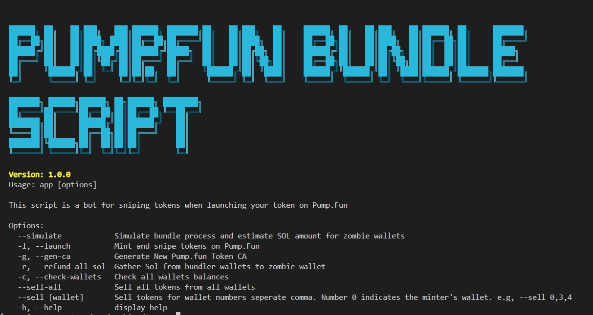

# ⚡ Pump.fun Bundle Script ⚡

1. To install node modules to run this command.

    `npm install`

    Please install node > 18.1.0

2. Set the environment variables to .env file.

    1) Create a .env file to run this command.
        
        `mv .env.example .env`

    2) Set the variables in .env file.

        `RPC_URL`: pump fun RPC url

        `JITO_MAINNET_URL`: JITO bundler service URL

        `JITO_TIP`: JITO tip (0.00005)

        `MINTER_PERCENT`: Percent of token to get in MINTER(generated PRIVATE_KEY) wallet when launching token

        `PERCENT`: Precent of token to buy from sniper wallets

        `WALLET_COUNT`: sniper wallet count

        `TOKEN_PK`: token private key generated from pump.fun (Please run following command: node app.js --generate-pumpfun-key)

        `ZOMBIE`: deposit wallet private key to disperse sol into sniper wallets

        `PRIVATE_KEY`: wallet private key to mint token

        `TOKEN_NAME`: token name to launch

        `TOKEN_SYMBOL`: token symbol to launch

        `TOKEN_IMAGE_URL`: Image file name, you just copy it to image folder

        `TOKEN_DESCRIPTION`: token description to launch

        `TOKEN_CREATEON`: optional e.g. https://pump.fun

        `TOKEN_TWITTER`: x site url for token

        `TOKEN_TELEGRAM`: telegram site for token

        `TOEKN_WEBSITE`: website for token

3. To show description of this script, you can run this command.

    `node app.js -h`

    `node app.js --version`

4. Launch senario.

    At first, please copy your meme coin image(filename: meme.png) to ./img folder.

    `node app.js --gen-ca`: generate pump.fun key to mint token
    
        You can see following as
        
        🚀 Staring to generate new PumpFun key...
        It could be take a little long time
        🔑 New Pumpfun Key:  2aTZP5c8vuWJVrxL1L6gyPGTML671jgJQyd2KdXdvPnMrHKhXjgh6Wr4XNbyMc7eXJ7tANHK5kLcpnfD5WK7qg
        🚩 End to generate new PumpFun key...

        please copy pumpfun key and set as TOKEN_PK in .env file

    `node app.js --simulate` : Get total sol amount of zombie wallet to disperse into sniper wallets.

        You can see this
        🚀 Starting to simulate...
        ┌─────────┬────────────┬────────────────────┬──────────────────────┐
        │ (index) │ Wallet     │ TokenAmount        │ SolAmount            │
        ├─────────┼────────────┼────────────────────┼──────────────────────┤
        │ 0       │ 'Dev'      │ 1073               │ 0.23003009030090274  │
        │ 1       │ 'Zombie1'  │ 19496.106346999102 │ 0.03054674273456446  │
        │ 2       │ 'Zombie2'  │ 20262.077989153986 │ 0.03056824449116207  │
        │ 3       │ 'Zombie3'  │ 13834.406674525415 │ 0.0303879945409621   │
        │ 4       │ 'Zombie4'  │ 21218.793735526044 │ 0.030595113734835325 │
        │ 5       │ 'Zombie5'  │ 19191.969903131387 │ 0.03053828864614203  │
        │ 6       │ 'Zombie6'  │ 11487.47584428664  │ 0.030322205328770238 │
        │ 7       │ 'Zombie7'  │ 13281.343191854327 │ 0.030372529051561865 │
        │ 8       │ 'Zombie8'  │ 18210.79497795466  │ 0.030510810500934953 │
        │ 9       │ 'Zombie9'  │ 17534.87260172933  │ 0.03049186737648758  │
        │ 10      │ 'Zombie10' │ 15497.113679803924 │ 0.03043471999434579  │
        │ 11      │ 'Zombie11' │ 18226.151743646977 │ 0.030511290176683845 │
        │ 12      │ 'Zombie12' │ 18899.88835398552  │ 0.030530208587304635 │
        │ 13      │ 'Zombie13' │ 14473.3092115874   │ 0.03040604006867597  │
        │ 14      │ 'Zombie14' │ 13371.295390155406 │ 0.03037513347926817  │
        │ 15      │ 'Zombie15' │ 12155.880471848966 │ 0.030341042979340736 │
        │ 16      │ 'Zombie16' │ 18939.78379863822  │ 0.030531386251063403 │
        │ 17      │ 'Zombie17' │ 19178.927632381732 │ 0.030538114967638346 │
        │ 18      │ 'Zombie18' │ 20915.69403524604  │ 0.030586866457094426 │
        │ 19      │ 'Zombie19' │ 16514.403725952005 │ 0.030463388321854894 │
        │ 20      │ 'Zombie20' │ 16627.14404794859  │ 0.030466566211858746 │
        │ 21      │ 'Zombie21' │ 18835.84018543481  │ 0.03052856086024011  │
        │ 22      │ 'Zombie22' │ 11328.877181335025 │ 0.030317913600977475 │
        └─────────┴────────────┴────────────────────┴──────────────────────┘
        TotalSol = 1.0003951186626698
        
        🚩 End to simulate...
        
        please deposit SOL into zombie wallet

    `node app.js --launch` : launch token and first buy with jito bundle in sniper wallets

5. To sell your token.

    `node app.js --sell [walletAddress]`: sell tokens specific one wallet number without bundling.
    `node app.js --sell 6axZGLwRyTnX9F9Vgc4JeWKqoravEsPC6uo9rS4WJakS,718zuEVqJmNJtp1ENuNkrKynx6xdTWcGGB4wWrqgFNWG`: sell tokens specific wallet address.
    `node app.js --sell-all`: sell tokens of all trading wallets
    
6. Refund SOL from sniper wallets to zombie wallet

    `node app.js --refund-all-sol`: Gather Sol from zombie wallets to zombie wallet.

7. Check wallets status

    `node app.js --check-wallets`: Gather Sol from zombie wallets to zombie wallet.

## ❤️ Much love to the fam
